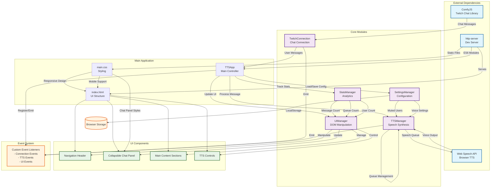

# Twitch-to-Speech Architecture

## System Overview

This mermaid chart explains the architecture, data flow, and package dependencies of the Twitch-to-Speech application.

## Key Features

### 1. **Modular Architecture**
- **TTSApp**: Main controller that orchestrates all modules
- **TwitchConnection**: Handles Twitch chat connection via ComfyJS
- **TTSManager**: Manages speech synthesis, voice assignment, and message queuing
- **UIManager**: Handles DOM manipulation and user interface updates
- **SettingsManager**: Manages user preferences and localStorage
- **StatsManager**: Tracks usage statistics and metrics

### 2. **Data Flow**
1. User connects to Twitch channel
2. ComfyJS receives chat messages
3. Messages are filtered and processed
4. TTS queue manages speech synthesis
5. UI updates in real-time
6. Settings persist across sessions

### 3. **Key Technologies**
- **ComfyJS**: Twitch chat integration
- **Web Speech API**: Browser-native text-to-speech
- **ES6 Modules**: Modern JavaScript module system
- **LocalStorage**: Client-side settings persistence
- **CSS Grid/Flexbox**: Responsive layout

### 4. **Features**
- Real-time Twitch chat integration
- Customizable TTS voices and settings
- Message filtering and user muting
- Collapsible live chat panel
- Mobile-responsive design
- Settings import/export
- Usage statistics tracking